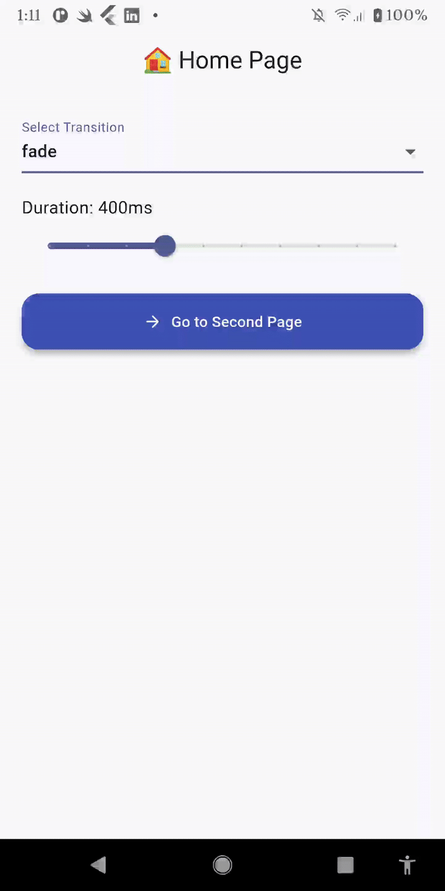

<!--
This README describes the package. If you publish this package to pub.dev,
this README's contents appear on the landing page for your package.

For writing tips, see:
https://dart.dev/tools/pub/writing-package-pages
-->

# 🚀 flutter_quick_nav

`flutter_quick_nav` is a lightweight Flutter navigation utility that simplifies screen transitions using clean and intuitive methods. It provides smooth built-in animations like `fade`, `slide`, `scale`, and `rotate`, and streamlines navigation with simple API calls like `push`, `replace`, and `pushAndRemoveUntil`.

[](https://pub.dev/packages/flutter_quick_nav)

---

## 📽 Demo

See the navigation in action:



---

## ✨ Features

- 🚀 Navigate to a new screen with custom transitions
- 🔁 Replace the current screen.
- 🧹 Push and remove all previous routes (with optional named route)
- 🎛️ Choose from `fade`, `slideLeft`, `slideRight`, `slideUp`, `slideDown`, `scale`, or `rotate` transitions
- ⏱️ Customize transition duration and animation curve
- 🧼 Clean, easy-to-use API
- 💯 Null safe

---

## 🚀 Screenshots

> *Note: This package affects screen transitions only, not UI layout.*

---

## 🔧 Installation

### 1. Depend on it

Add this to your package’s `pubspec.yaml` file:

```yaml
dependencies:
  flutter_quick_nav: ^1.0.2
```

### 2. Install it

Run either of the following commands in your terminal:


```yaml
  flutter pub get
```

### 3. Import it

```yaml
  import 'package:flutter_quick_nav/flutter_quick_nav.dart';
```

## 🔹 Quick Usage

### ➕ Push a new screen

```yaml
  FlutterQuickNav.push(context, const SecondPage());
```
  
### 🔁 Replace the current screen

```yaml
  FlutterQuickNav.replace(context, const FinalPage());
```

### 🧹 Push and remove all previous screens

```yaml
  FlutterQuickNav.pushAndRemoveUntil(context,const HomePage());
```
### 📛 Push and remove until a named route
```yaml
  FlutterQuickNav.pushAndRemoveUntil(context,const HomePage(),untilRoute: '/home',);
```

### 🎛️ With transition type, duration, and curve
```yaml
 FlutterQuickNav.push(
  context,
  const SettingsPage(),
  type: TransitionType.slideUp,
  duration: const Duration(milliseconds: 500),
  curve: Curves.easeInOut,
);
```

### ✨ Supported Transitions

| Transition Type | Description                     |
|-----------------|---------------------------------|
| `fade`          | Fades between screens           |
| `slideLeft`     | Slides in from the right        |
| `slideRight`    | Slides in from the left         |
| `slideUp`       | Slides in from the bottom       |
| `slideDown`     | Slides in from the top          |
| `scale`         | Zoom in/out scale transition    |
| `rotate`        | Rotates the new screen in       |


## 🧑‍💻 Usage Example

```yaml
import 'package:flutter/material.dart';
import 'package:flutter_quick_nav/flutter_quick_nav.dart';

void main() => runApp(const MyApp());

class MyApp extends StatelessWidget {
  const MyApp({super.key});

  @override
  Widget build(BuildContext context) {
    return MaterialApp(
      title: 'flutter_quick_nav Example',
      debugShowCheckedModeBanner: false,
      theme: ThemeData(
        colorScheme: ColorScheme.fromSeed(seedColor: Colors.indigo),
        useMaterial3: true,
      ),
      home: const HomePage(),
      // routes: {'/home': (context) => const HomePage()}, // Optional
    );
  }
}

class HomePage extends StatelessWidget {
  const HomePage({super.key});

  @override
  Widget build(BuildContext context) {
    return Scaffold(
      appBar: AppBar(title: const Text('🏠 Home Page'), centerTitle: true),
      body: Center(
        child: ElevatedButton.icon(
          onPressed: () => FlutterQuickNav.push(context, const SecondPage()),
          icon: const Icon(Icons.arrow_forward_rounded),
          label: const Text('Go to Second Page'),
          style: _buttonStyle(),
        ),
      ),
    );
  }
}

class SecondPage extends StatelessWidget {
  const SecondPage({super.key});

  @override
  Widget build(BuildContext context) {
    return Scaffold(
      appBar: AppBar(title: const Text('🧭 Second Page'), centerTitle: true),
      body: Center(
        child: Column(
          mainAxisAlignment: MainAxisAlignment.center,
          children: [
            ElevatedButton.icon(
              onPressed: () =>
                  FlutterQuickNav.replace(context, const FinalPage()),
              icon: const Icon(Icons.auto_awesome),
              label: const Text('Replace with Final Page'),
              style: _buttonStyle(background: Colors.deepPurple),
            ),
            const SizedBox(height: 20),
            ElevatedButton.icon(
              onPressed: () => FlutterQuickNav.pushAndRemoveUntil(
                context,
                const HomePage(),
              ),
              icon: const Icon(Icons.home_rounded),
              label: const Text('Reset to Home'),
              style: _buttonStyle(background: Colors.green),
            ),
          ],
        ),
      ),
    );
  }
}

class FinalPage extends StatelessWidget {
  const FinalPage({super.key});

  @override
  Widget build(BuildContext context) {
    return Scaffold(
      appBar: AppBar(title: const Text('🎯 Final Page'), centerTitle: true),
      body: const Center(
        child: Text(
          '🎉 You made it to the final page!',
          style: TextStyle(fontSize: 20, fontWeight: FontWeight.w600),
          textAlign: TextAlign.center,
        ),
      ),
    );
  }
}

ButtonStyle _buttonStyle({Color background = Colors.indigo}) {
  return ElevatedButton.styleFrom(
    padding: const EdgeInsets.symmetric(horizontal: 24, vertical: 16),
    shape: RoundedRectangleBorder(
      borderRadius: BorderRadius.circular(16),
    ),
    elevation: 4,
    backgroundColor: background,
    foregroundColor: Colors.white,
  );
}

```

## 📦 Null Safety
This package is 100% null-safe and compatible with the latest Flutter versions.

## 💡 Contribution
Contributions, issues, and feature requests are welcome!
Feel free to open an issue or submit a pull request.

## 📄 License
This project is licensed under the MIT License — see the LICENSE file for details.

## 🙌 Support
If you like this package, don't forget to give it a ⭐ on GitHub and share it with others!
